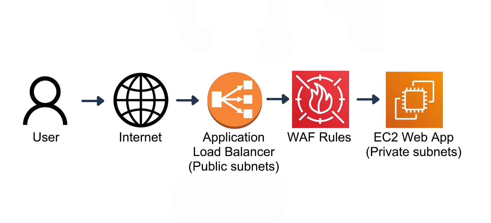

# AWS CSS – Domain 3 – Zero Trust Networking with VPC Security & AWS WAF  

Built and secured a public-facing application in AWS using **VPC Security Groups, NACLs, ALB and AWS WAF** to demonstrate a **Zero Trust, defense-in-depth architecture**.  

**Why it matters:** Public workloads in AWS are frequent attack targets. By layering **network controls (SGs + NACLs)** and **application-layer protections (WAF)**, this lab shows how to enforce **least privilege** and block malicious traffic before it reaches the app.  

---

## Table of Contents

- [Overview](#overview)  
- [Objectives](#objectives)  
- [Diagram](#diagram)  
- [Steps Performed](#steps-performed)  
  - [1. VPC & ALB Deployment]
  - [2. Security Groups & NACL Restrictions]
  - [3. AWS WAF Setup & Managed Rules]
  - [4. Testing & Logging]
  - [5. Cleanup]
- [Screenshots](#screenshots)  
- [Lessons Learned](#lessons-learned)  
- [References](#references)  
- [Cleanup](#cleanup)  
- [Contact](#contact)  

---

## Overview

This lab implements a **Zero Trust networking model** in AWS:  

- Users only access the app through an **internet-facing ALB**.  
- EC2 workloads run in **private subnets** with **no public IPs**.  
- Security Groups enforce **SG-to-SG communication only**.  
- NACLs restrict subnet-level traffic to the minimum.  
- AWS WAF inspects requests at the ALB and blocks **SQLi, IP reputation threats and anonymous IPs**.  

---

## Objectives

- Design a **VPC with public/private subnet separation**.  
- Restrict traffic paths using **least privilege SGs + NACLs**.  
- Deploy an **Application Load Balancer** as the only internet-facing entry.  
- Attach an **AWS WAF Web ACL** with managed rule sets.  
- Validate blocked vs allowed requests with **CloudWatch metrics and S3 logs**.  

---

## Diagram

Flow: **User → ALB (Public Subnets) → WAF Rules → EC2 Web App (Private Subnets) → Logs (CloudWatch + S3)**  

  

---

## Steps Performed

### 1. VPC & ALB Deployment  
   - Created VPC with **2 public + 2 private subnets** *(Screenshots: `vpc-summary.png` & `vpc-resource-map.png`)*
   - Deployed EC2 instance in private subnet with **Nginx web app** *(Screenshot: `ec2-running.png`)*  
   - Provisioned ALB in public subnets as internet entry point *(Screenshots: `alb-config.png` & `alb-active.png`)*  
   - Validated baseline access *(Screenshot: `app-browser.png`)*  

### 2. Security Groups & NACL Restrictions  
   - Configured **ALB SG** to allow HTTP from internet *(Screenshot: `alb-sg-inbound.png`)*
   - Configured **EC2 SG** to allow HTTP only from ALB SG *(Screenshot: `ec2-sg-inbound.png`)* 
   - Applied **Public NACL**: allow HTTP from 0.0.0.0/0 *(Screenshot: `public-nacl-rules.png`)* 
   - Applied **Private NACL**: allow HTTP only from ALB subnet CIDRs *(Screenshot: `private-nacl-rules.png`)* 
   - Verified ALB reachable; EC2 direct access denied *(Screenshot: `ec2-browser-fail.png`)*  

### 3. AWS WAF Setup & Managed Rules  
   - Created Web ACL `ZeroTrustWebACL` and attached to ALB *(Screenshot: `web-acl-creation.png`)*
   - Added AWS Managed Rule Sets: SQLi, IP Reputation, Anonymous IP *(Screenshot: `waf-managed-rules.png`)* 
   - Verified rules in console *(Screenshot: `web-acl-summary.png`)*  

### 4. Testing & Logging  
   - Normal traffic allowed *(Screenshot: `normal-request.png`)*  
   - SQL injection request blocked with **403 Forbidden** *(Screenshot: `sqli-blocked.png`)*  
   - CloudWatch metrics confirmed blocked vs allowed counts *(Screenshot: `waf-logs.png`)*  
   - Raw WAF logs stored in S3 for forensic analysis *(Screenshot: `waf-s3-logs.png`)*  
   - Target group showed EC2 remained healthy *(Screenshots: `target-group.png` & `target-group-healthy.png`)*  

### 5. Cleanup
   - Delete **Application Load Balancer** first, then its Target Group.  
   - Next is **AWS WAF Web ACL** → remove logging configuration, delete Web ACL.  
   - Terminate **EC2 instances**.  
   - **Networking inside the VPC**:  
      - Subnets (public & private)  
      - Route tables (non-main)  
      - Internet Gateway (detach, then delete)  
      - Security Groups (non-default)  
      - Network ACLs (non-default)  
      - VPC → delete once all dependencies are gone.  
   - **S3 bucket** *(if used for WAF logs)* → empty and delete.  

---

## Screenshots

*All screenshots are included in the `screenshots/` folder.*  

| Step | Filename                | Description                                      |
| ---- | ----------------------- | ------------------------------------------------ |
| 1    | vpc-summary.png         | VPC creation summary with subnets and IGW        |
| 1    | vpc-resource-map.png    | Resource map showing subnets + routing           |
| 1    | ec2-running.png         | EC2 instance running in private subnet           |
| 1    | alb-config.png          | ALB configuration details                        |
| 1    | alb-active.png          | ALB status active with DNS name                  |
| 1    | app-browser.png         | Web app visible via ALB DNS                      |
| 2    | alb-sg-inbound.png      | ALB SG inbound rules (HTTP from internet)        |
| 2    | ec2-sg-inbound.png      | EC2 SG inbound rules (HTTP from ALB SG)          |
| 2    | public-nacl-rules.png   | Public subnet NACL allowing HTTP                 |
| 2    | private-nacl-rules.png  | Private subnet NACL restricted to ALB subnets    |
| 2    | ec2-browser-fail.png    | Direct EC2 access blocked (no public IP)         |
| 3    | web-acl-creation.png    | Web ACL creation page                            |
| 3    | waf-managed-rules.png   | AWS Managed WAF rules enabled                    |
| 3    | web-acl-summary.png     | Web ACL summary with attached ALB                |
| 4    | normal-request.png      | Normal HTTP request allowed                      |
| 4    | sqli-blocked.png        | SQL injection request blocked (403 Forbidden)    |
| 4    | waf-logs.png            | WAF metrics showing blocked requests             |
| 4    | waf-s3-logs.png         | Raw JSON log of blocked requests in S3           |
| 4    | target-group.png        | Target group setup for EC2 instance              |
| 4    | target-group-healthy.png| Target group health check success                |

---

## Lessons Learned

- **Zero Trust requires layers**: ALB, SGs, NACLs and WAF each add unique value.  
- **SGs vs NACLs**: SGs control instance-level traffic, NACLs enforce subnet-wide boundaries.  
- **WAF value**: Blocks SQLi and other exploits before they reach the app.  
- **Logging matters**: CloudWatch metrics and S3 logs provide proof of enforcement.  
- **Defense-in-depth**: No single layer is enough; combined they create resilience.  

---

## References

- [Amazon VPC](https://docs.aws.amazon.com/vpc/latest/userguide/what-is-amazon-vpc.html)  
- [Application Load Balancer](https://docs.aws.amazon.com/elasticloadbalancing/latest/application/introduction.html)  
- [AWS WAF](https://docs.aws.amazon.com/waf/latest/developerguide/what-is-aws-waf.html)  
- [Security Groups](https://docs.aws.amazon.com/vpc/latest/userguide/VPC_SecurityGroups.html)  
- [Network ACLs](https://docs.aws.amazon.com/vpc/latest/userguide/vpc-network-acls.html)  
- [Amazon CloudWatch](https://docs.aws.amazon.com/AmazonCloudWatch/latest/monitoring/WhatIsCloudWatch.html)  

---

## Contact

Sebastian Silva C. – September 2025 – Berlin, Germany.  
- [LinkedIn](https://www.linkedin.com/in/sebastiansilc/)  
- [GitHub](https://github.com/AWS-CSS-Portfolio)  
- [sebastian@playbookvisualarts.com](mailto:sebastian@playbookvisualarts.com)  
